> # 🚨 SIGNAL BADLA AAJ: MILD UP -> STRONG UP
# 🙋 AAJ KA SIGNAL — Simple Bhasha Mein
### Date: 2026-10-09 (shaam ke NSE data se) | Nifty: 22520.45

---

## 🟢🟢 EK LINE MEIN:
> **Market gir ke sasta hua hai aur bade khiladi (operators/FII) chupke se KHARID rahe hain — naya swing trade shuru karne ka SABSE ACHHA mauka. Aise mauke saal mein sirf 2-3 baar aate hain.**

---

## ✅ STEP-BY-STEP — AAJ KARNA KYA HAI:
1. Jitna paisa is trade ke liye socha hai, usse 3 hisson mein baanto
2. Pehla hissa (1/3) AAJ/KAL kharido (Nifty 50 index fund / NIFTYBEES)
3. Dusra hissa tab kharido agar market 2% aur gire
4. Teesra hissa tab agar 4% aur gire — girna accha hai, aur sasta milega!
5. Har kharid par likh lo: 'agar meri kharid se 8% niche gaya to bech dunga' — ye wada khud se karo

---

## 💰 TOTAL KITNA PAISA MARKET MEIN RAKHNA HAI: **60%**
Matlab: agar tumhare paas kul **₹1,00,000** hai investing ke liye, to abhi sirf
**₹60,000** market mein ho aur **₹40,000 cash** mein.
Kyun? Market girawat mein hai LEKIN bade khiladi kharid rahe hain — dheere-dheere jama karne ka zone — isliye aadhe se thoda zyada invested raho, girawat par kharidte raho.

---

## 📖 MARKET KA HAAL (simple):
| Cheez | Status | Matlab |
|---|---|---|
| Market ka trend | **NEECHE ⬇️** | Nifty apni 200-din ki average price se niche hai = kamzor |
| Bade khiladi (FII/operators) | **STRONG UP** | score +3.77 (+2.5 se upar = zor se kharid rahe; -2.5 se niche = zor se bech rahe) |
| 🟢 Bottom signal | **🟢 ACTIVE** | Market sasta + bade log kharid rahe = bottom banne wala hai (10 mein 8 baar sahi) |
| 🔴 Top warning | **off** | abhi nahi |

**Is signal ki accuracy:** Pichle 15 saal mein ye signal 40 baar aaya — 10 mein se 8 baar market 20 din ke andar bottom bana ke upar gaya.

---

## 🔭 AAGE KA NAZARIYA (aaj ke OI signal ke baad kya hota aaya hai — 15 saal ka hisaab)

| Kitne time baad | Kya expect karein | Imandar sach |
|---|---|---|
| **Kal (1 din)** | 🚫 Prediction NAHI | Humne 15 saal test kiya — agle din ka koi bhi signal **coin-flip** hai (53% up, har bucket mein same). Jo bhi "kal ye hoga" bole, usse door raho. |
| **1-4 din** | +0.2% avg, 57% baar upar | Bucket se 1-4 din ka koi bharosemand edge NAHI (aaj ka bucket +0.2%/57% vs baseline +0.2%/56% — farak na ke barabar). Sirf ⚡/🌀 flags fire hone par halka jhukav banta hai. |
| **15 din (3 hafte)** | +0.8% avg, 59% baar upar | Aaj ka bucket: +0.8%/59% vs baseline +0.7%/60%. Yahan se signal jaagna shuru hota hai (curve-test: 15d par bearish edge pakki, bullish edge 20d+ se) — par asli kaam 20-60 din mein hi hota hai. |
| **1 mahina (20 din)** | +1.2% avg, **63% baar upar** | baseline jitna hi (baseline +1.0%/62%). Halka edge shuru hota hai. |
| **2 mahine (40-60 din)** | +4.2% avg, **79% baar upar** | baseline se BEHTAR (baseline +3.0%/68%). **YAHI is system ka asli edge hai** — isliye swing hold 1-2 mahine ka hai. |

> 💡 **Matlab:** aaj entry lo to result ka asli test **1-2 mahine baad** hona hai. Beech ke din-hafte ka shor ignore karo — stop-loss (-10%) ke alawa koi reaction mat do.

## 📒 SYSTEM KA APNA REPORT CARD (pichhle 12 mahine ke 207 daily signals — khud ka hisaab)

**20-din accuracy: 74%  |  40-din accuracy: 60%** (✅ = jo promise kiya wahi hua: bullish/neutral bucket → market upar; STRONG_DOWN → market baseline se kamzor)

| Bucket | Signals | 20-din sahi | 40-din sahi | Avg 20d | Avg 40d |
|---|---|---|---|---|---|
| STRONG_UP | 52 | 56% | 37% | +0.4% | -0.7% |
| MILD_UP | 34 | 79% | 44% | +1.4% | -1.0% |
| NEUTRAL | 52 | 65% | 48% | +0.5% | -0.6% |
| MILD_DOWN | 17 | 71% | 76% | +1.1% | +0.4% |
| STRONG_DOWN | 52 | 100% | 100% | -4.3% | -4.9% |

**Aakhri 6 pakke (matured) signals:**

| Signal din | Bucket | 20-din result | 40-din result |
|---|---|---|---|
| 2026-08-12 | STRONG_DOWN | -4.1% ✅ | -7.8% ✅ |
| 2026-08-11 | STRONG_DOWN | -3.4% ✅ | -8.9% ✅ |
| 2026-08-10 | STRONG_DOWN | -3.3% ✅ | -8.1% ✅ |
| 2026-08-07 | STRONG_DOWN | -2.7% ✅ | -7.3% ✅ |
| 2026-08-06 | STRONG_DOWN | -3.1% ✅ | -8.4% ✅ |
| 2026-08-05 | STRONG_DOWN | -2.9% ✅ | -8.9% ✅ |

**Abhi chal rahe (open) signals:**

| Signal din | Bucket | Beete din | Ab tak |
|---|---|---|---|
| 2026-10-08 | MILD_UP | 1 din | +1.1% ⏳ |
| 2026-10-07 | MILD_UP | 2 din | -0.4% ⏳ |
| 2026-10-06 | MILD_UP | 3 din | -1.1% ⏳ |
| 2026-10-05 | STRONG_UP | 4 din | -0.2% ⏳ |
| 2026-10-01 | MILD_UP | 5 din | +0.4% ⏳ |

> 🪞 **Ye section khud-ba-khud roz update hota hai — system apne purane signals se bhaag nahi sakta.** Accuracy girne lage to turant dikh jayega.

## 📋 SYSTEM KA KHULA SWING TRADE (virtual — NIFTYBEES/Nifty)

| Cheez | Status |
|---|---|
| Entry | **22,603** (2026-10-07, B3 STRONG_BUY par) |
| Abhi | **22,520** → P&L **-0.37%** 🔴 |
| Stop-loss (-10%) | **20,343** (abhi stop se +10.7% upar) |
| Exit signal | score abhi +3.8 (exit jab <= -2.5) — HOLD |
| Hold duration | 2 din (target hold: 1-2 mahine) |

> 🎯 **Matlab:** trade chaalu hai — kuch mat karo. Sirf 2 cheez par exit: (1) Nifty 20,343 ke neeche band ho, ya (2) yahan exit signal aa jaye. Beech ka shor ignore.

## 🏦 BANK NIFTY — WAHI SIGNAL, DUSRA INDEX (15-saal verified)

**Aaj:** Bank Nifty **55,257** (+1.36% din ka)

| Horizon | Aaj ke bucket (STRONG UP) ke baad BNF | Baseline |
|---|---|---|
| 15 din | +1.1% avg, 60% baar upar | +0.9% / 58% |
| 1 mahina | +1.5% avg, 62% baar upar | +1.2% / 59% |
| 2 mahine | **+3.4% avg, 75% baar upar** | +2.4% / 64% |

> 💡 Participant OI (FII/Pro) ka signal poore market ka hai — Bank Nifty par bhi 15 saal test kiya
> (correlation +0.157 @40d). STRONG_UP mein BNF ka 2-mahina record Nifty se bhi tez hai
> (out-of-sample +3.8%/79%). Trade karna ho to **BANKBEES** ETF.

## 🧭 SECTOR ROTATION — SABSE MAJBOOT SECTOR (15-saal tested)

**✅ ACTIVE** — OI signal bullish hai (score +3.8 ≥ +1.0), to sector tilt ka tested edge ABHI chalu hai.

| Rank | Sector | 6-mahina momentum |
|---|---|---|
| 1 | 🟢 **Telecom** | +9.5% |
| 2 | 🟢 **Pharma** | +5.2% |
| 3 | · **Realty** | +0.9% |
| 4 | · **Bank** | -0.1% |
| 5 | · **Infra** | -0.2% |
| 6 | · **Consumer** | -0.5% |
| 7 | · **IT** | -1.7% |
| 8 | · **CapGoods** | -2.2% |
| 9 | · **Auto** | -4.6% |
| 10 | · **Energy** | -6.4% |
| 11 | · **FMCG** | -8.3% |
| 12 | · **Finance** | -11.9% |
| 13 | · **Cement** | -12.9% |
| 14 | 🔴 **Power** | -14.7% |
| 15 | 🔴 **Metal** | -15.4% |

**Kya karna:** Agar stocks lene hain to in 2 sectors ke stocks mein lagao — **Telecom + Pharma**. 15-saal test: in top-2 sectors ka basket, bullish signal ke waqt, baaki market se **+0.8 se +1.0pp (40 din) / +0.8 se +1.4pp (60 din)** aage raha (out-of-sample bhi). ⚠️ Lekin: sector ke 1-2 stocks chunne ka edge test mein NAHI mila — **sector ke 3-4 bade stocks mein barabar baanto** (ya ETF jahan available: Pharma→PHARMABEES).

**Top-2 sectors ke stocks (RS order, sirf jankari ke liye):**
- **Telecom:** IDEA (+37%), BHARTIARTL (-2%), INDUSTOWER (-7%)
- **Pharma:** DIVISLAB (+53%), AUROPHARMA (+20%), ZYDUSLIFE (+19%), TORNTPHARM (+12%), CIPLA (+7%), SUNPHARMA (+3%)

> 🔴 = sabse kamzor 2 sectors — yahan naya paisa mat lagao.
> 📏 Rule yaad rakho: KAB/KITNA upar ka MASTER SIGNAL batata hai — ye section sirf **KAHAN** (kaunsa sector) batata hai. Stop-loss -10% yahan bhi.

## 💎 GEM SCANNER — 25-40% MOVER ka setup AAJ FIRE (2026-10-09)

**Pattern (15y decoded):** 52w-high se **40%+ gira** + **EMA50 wapas reclaim** (stabilize ho gaya) + **volume 1.5x surge** (koi bada jama kar raha). Test: aise setup ka **32.4%** chance hota hai +25% move ka (normal stock ka sirf 10.7%).

| Grade/Stock | Price | 52w-high se | Volume | Reclaim | Stop (-12%) | Target (+25%) |
|---|---|---|---|---|---|---|
| 💎A **TRENT** (Consumer) | 2,876.3 | -40.2% | 2.27x | 4d | **2,531.1** | **3,595.4** |

**Trade plan (tested):** entry agle din · stop **-12%** · target **+25%** · max hold **3 mahine**. Upgraded 15y stats (fresh+penny-guard): **IS +6.7%/55% win, OOS +11.5%/75% win**. Winner anatomy: median **24 din** mein target; jeetne wale bhi pehle ~4% dubte hain — **ghabrao mat, stop -12 hi bharosa hai** (15% winners -8% tak gaye the). ⚠️ Bear saal mein ye rule bhi haarta hai (2011: -12%) — kitna lagana MASTER SIGNAL ka deploy % tay karega. **Ek gem = portfolio ka 5-10% max.** Grade B (purana reclaim >10 din) = chhod do (OOS sirf +1.9%/38%).

**📒 Pichle gems ka hisaab:** 2026-10-08 TRENT: 🔄 OPEN -0% (1d) · 2026-10-09 TRENT: ⏳ naya

> 🔎 *Imandari note: backtest aaj ke zinda stocks par hai (survivorship) — isliye real expectancy thodi kam maan ke chalo; position sizing (5-10% max) hi asli suraksha hai. Midcaps par ye pattern TEST KIYA aur FAIL hua (+1.2% vs +6.7-11.5%) — gems sirf LARGE-CAP mein khoje jayenge, kyunki quality ka floor wahi hota hai.*

## 🏆 STOCK SWEEP — NIFTY 50 KE SABSE STRONG STOCKS (2026-10-08)

**Rule (15-saal tested):** A+ = price EMA50 ke upar **+** RS top-10% (126-din return, 50 stocks mein).
In stocks ne equal-weight basket ko average **+1.0pp (40 din) / +1.7pp (60 din)** se beat kiya
(out-of-sample bhi positive: +0.5/+1.1pp). Edge chhota par 15 saal consistent — horizon **1-3 mahine**.

| Stock | Grade | RS rank /100 | 1-mahina return | Price |
|---|---|---|---|---|
| **DIVISLAB** | A+ ⭐ | 100 | -0.6% | 9,429 |
| **KOTAKBANK** | A+ ⭐ | 95 | +5.9% | 438 |
| **TRENT** | A+ ⭐ | 93 | +2.6% | 2,894 |

> 💡 **Kaise use karein:** ye "kya kharidna" ka shortlist hai — lekin **kab/kitna** upar wala MASTER
> SIGNAL hi batayega. Entry signal weak ho to shortlist sirf watchlist hai. Stop-loss -10% yahan bhi pakka.

---

## 🧒 PAKKE NIYAM (har naye bande ke liye, HAMESHA):
1. **Stop-loss -10%:** jo bhi kharido, kharid-price se 10% girte hi bech do. Bina sawal. (15-saal test: -8% se -10% behtar nikla — bazaar ke chhote jhatke trade ko bekar mein nahi todte, aur bade nuksan se phir bhi bachata hai.)
2. **Kabhi ek saath pura paisa nahi** — hamesha 2-3 kisht mein.
3. **Udhaar/EMI/zaroorat ka paisa KABHI nahi** — sirf wo paisa jo 6 mahine na chahiye.
4. Ye system 10 mein se 7-8 baar sahi hai — **2-3 baar galat bhi hoga.** Isliye upar ke niyam hi tumhara asli bachav hain.
5. Kya kharidna hai confusion ho to: **NIFTYBEES** (Nifty 50 ETF) — isi index par ye pura system bana hai.

*Ye financial advice nahi hai — 15 saal ke data par bana educational system hai. | Generated: 2026-10-09T20:20:21+00:00 UTC*

---

## 🧲 INDEX SWEEP SCANNER — konsa index STRONG hai?

*Session: 2026-10-09 · scan: saare NSE indices (bond/G-sec chhodke)*

**Ye kya hai (1 line):** Jab koi index apne purane LOW ke niche wick maar ke wapas UPAR band ho (= stop-loss hunt complete), to wo index aur uske stocks aage strong rehne ke candidate hain.

### ✅ Aaj 16 index mein SWEEP COMPLETE hua:

| # | GRADE | Index | 20d RS rank | Swept Level | Depth% | Wick% | Close vs Level | RSI | Trend(>E50) | Score |
|---|-------|-------|-------------|-------------|--------|-------|----------------|-----|-------------|-------|
| 1 | 🟡 B | **Nifty Capital Markets** | 75/100 | 5122.60 | 0.19 | 65 | +1.14% | 45 | ❌ | 56 |
| 2 | 🟡 B | **Nifty MidSmallcap400 Momentum Quality 100** | 71/100 | 48856.00 | 0.44 | 36 | +1.17% | 40 | ❌ | 53 |
| 3 | 🟡 B | **Nifty Smallcap250 Momentum Quality 100** | 67/100 | 46871.85 | 0.32 | 60 | +0.86% | 41 | ❌ | 57 |
| 4 | 🟡 B | **Nifty Smallcap 500** | 63/100 | 19946.95 | 0.28 | 59 | +1.02% | 38 | ❌ | 62 |
| 5 | 🟡 B | **Nifty MidSmall Healthcare** | 62/100 | 49618.85 | 0.40 | 44 | +1.19% | 39 | ❌ | 57 |
| 6 | 🟡 B | **Nifty Smallcap250 Quality 50** | 59/100 | 23874.75 | 0.22 | 45 | +0.62% | 34 | ❌ | 51 |
| 7 | 🟡 B | **Nifty Smallcap 50** | 57/100 | 9404.55 | 0.05 | 53 | +1.55% | 40 | ❌ | 61 |
| 8 | ⚪ C | **Nifty500 LargeMidSmall Equal-Cap Weighted** | 48/100 | 17313.60 | 0.15 | 32 | +1.06% | 35 | ❌ | 54 |
| 9 | ⚪ C | **Nifty500 Multicap Momentum Quality 50** | 43/100 | 39149.20 | 0.42 | 54 | +1.16% | 38 | ❌ | 59 |
| 10 | ⚪ C | **Nifty Total Market Momentum Quality 50** | 42/100 | 41833.30 | 0.28 | 52 | +1.36% | 39 | ❌ | 60 |
| 11 | ⚪ C | **Nifty MidSmallcap400 50:50** | 41/100 | 19545.55 | 0.16 | 40 | +1.16% | 36 | ❌ | 56 |
| 12 | ⚪ C | **Nifty MidSmallcap 400** | 38/100 | 19953.50 | 0.26 | 35 | +1.06% | 36 | ❌ | 54 |
| 13 | ⚪ C | **Nifty200 Momentum 30** | 28/100 | 28826.40 | 0.52 | 36 | +1.29% | 39 | ❌ | 52 |
| 14 | ⚪ C | **Nifty High Beta 50** | 14/100 | 4048.55 | 0.12 | 40 | +1.10% | 35 | ❌ | 56 |
| 15 | ⚪ C | **Nifty Mobility** | 12/100 | 20993.55 | 0.16 | 39 | +1.31% | 31 | ❌ | 60 |
| 16 | ⚪ C | **Nifty India Defence** | 2/100 | 8887.75 | 0.10 | 53 | +1.34% | 38 | ❌ | 61 |

**GRADE ka matlab (1 saal, 131 indices, 1,486 sweeps par test kiya):**
- 🟢 **A+** = sweep + index pehle se STRONG (RS≥50) + trend upar → aage 10-20 din baaki market se behtar chalne ke best chances (+0.9% extra, 54-55% beat)
- 🟡 **B** = sweep + (strong RS *ya* uptrend, dono nahi) → theek-thaak, half conviction
- ⚪ **C** = weak index ka counter-trend sweep → KOI edge nahi mila, sirf jaankari

**Aaj ka #1: Nifty Capital Markets** (🟡 B) — level 5122.60 sweep karke +1.14% upar band hua.

**Kaise use karna (swing ke liye):**
- Ye WATCHLIST hai, buy-order nahi — A+ wale index (aur uske bade stocks) nazar mein rakho
- Agle din index **5122.60 ke UPAR TIKA RAHE** to setup valid
- Setup FAIL = close wapas sweep low (5112.70) ke niche → bhool jao
- Paisa lagana hamesha MASTER SIGNAL (upar wala) ke hisab se — ye scanner sirf batata hai KONSA index/sector strong hai

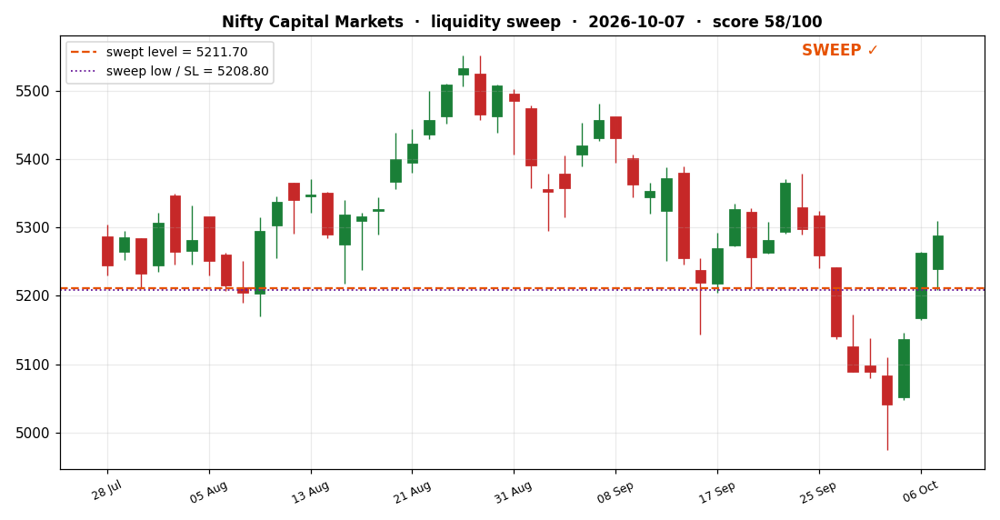

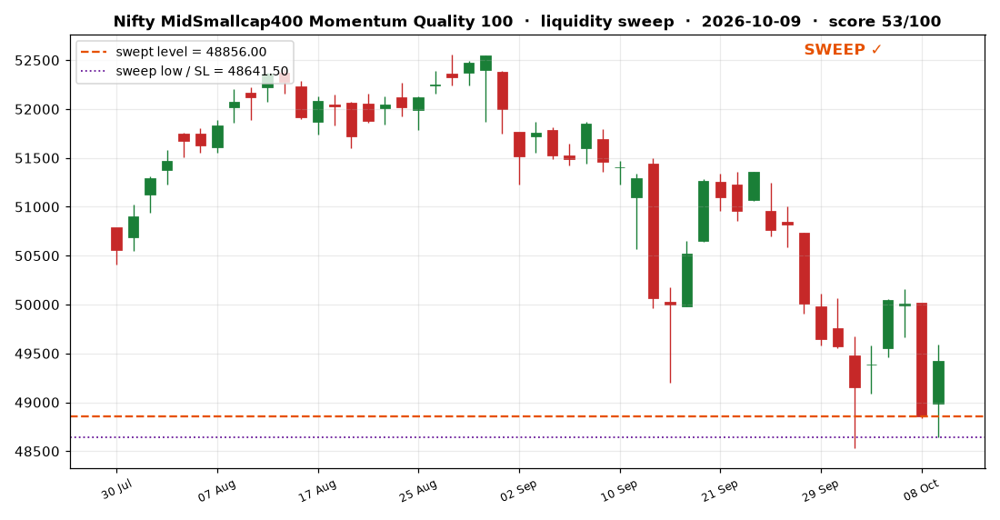

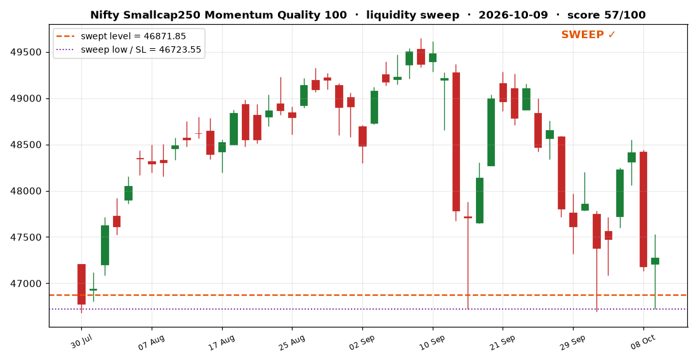

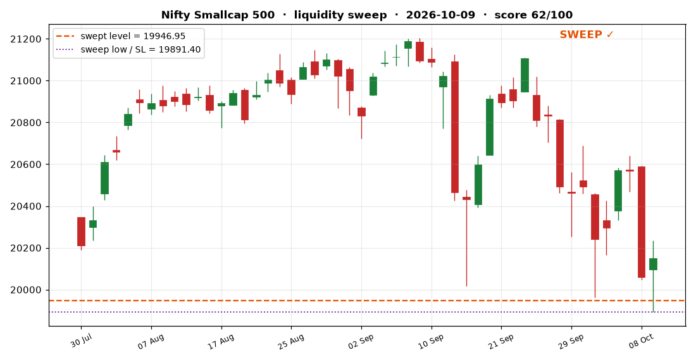

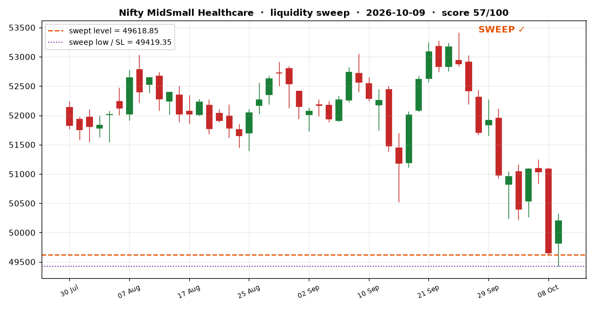

---

## 📅 WEEKLY SWEEP SCANNER — bada timeframe, zyada strong signal

*Last closed week ke hisab se · data till 2026-10-09 · ye signal pura hafta valid rehta hai*

**Ye kya hai (1 line):** Jo kaam daily sweep 1 din mein karta hai, wahi WEEKLY candle par ho to bade khiladi ka POORE HAFTE ka sauda dikhta hai — isliye ye signal zyada bharosemand hai (15-saal test: Nifty +8 hafte 69% win, Bank Nifty 76% win).

### ✅ Pichle closed week mein 16 index par WEEKLY SWEEP COMPLETE:

| # | GRADE | Index | Sweep type | Swept Level | Depth% | Wick% | Pools | 8w RS | Trend | Score |
|---|-------|-------|-----------|-------------|--------|-------|-------|-------|-------|-------|
| 1 | 🟢 A+ | **Nifty MidSmallcap400 Momentum Quality 100** | old swing-low sweep | 49125.70 | 0.99 | 49 | 1 | 75/100 | ❌ | 50 |
| 2 | 🟢 A+ | **Nifty Services Sector** | new-low sweep | 28619.95 | 0.30 | 78 | 1 | 65/100 | ❌ | 57 |
| 3 | 🟢 A+ | **Nifty50 Value 20** | 52w-low sweep | 11001.15 | 0.40 | 71 | 2 | 64/100 | ❌ | 56 |
| 4 | 🟡 B | **Nifty Top 20 Equal Weight** | old swing-low sweep | 8240.40 | 1.18 | 54 | 1 | 47/100 | ❌ | 57 |
| 5 | 🟡 B | **Nifty Low Volatility 50** | new-low sweep | 22658.85 | 0.62 | 52 | 1 | 38/100 | ❌ | 43 |
| 6 | 🟡 B | **Nifty500 Low Volatility 50** | new-low sweep | 20531.80 | 0.87 | 59 | 1 | 37/100 | ❌ | 57 |
| 7 | 🟡 B | **NIFTY Alpha Quality Value Low-Volatility 30** | new-low sweep | 18547.95 | 0.98 | 57 | 1 | 35/100 | ❌ | 57 |
| 8 | 🟡 B | **Nifty IT** | old swing-low sweep | 28442.40 | 2.76 | 82 | 1 | 28/100 | ❌ | 76 |
| 9 | 🟡 B | **Nifty Dividend Opportunities 50** | 52w-low sweep | 5360.05 | 0.91 | 63 | 2 | 22/100 | ❌ | 61 |
| 10 | 🟡 B | **Nifty100 Low Volatility 30** | new-low sweep | 18402.40 | 0.43 | 55 | 1 | 21/100 | ❌ | 45 |
| 11 | 🟡 B | **Nifty Shariah 25** | new-low sweep | 7313.20 | 0.56 | 54 | 1 | 19/100 | ❌ | 48 |
| 12 | 🟡 B | **NIFTY200 Quality 30** | new-low sweep | 18587.35 | 0.54 | 66 | 1 | 14/100 | ❌ | 57 |
| 13 | 🟡 B | **Nifty50 Shariah** | 52w-low sweep | 3876.20 | 0.49 | 69 | 2 | 13/100 | ❌ | 56 |
| 14 | 🟡 B | **Nifty Growth Sectors 15** | 52w-low sweep | 10329.35 | 1.09 | 67 | 2 | 7/100 | ❌ | 61 |
| 15 | 🟡 B | **Nifty50 TR 2x Leverage** | 52w-low sweep | 15341.65 | 0.46 | 56 | 2 | 1/100 | ❌ | 48 |
| 16 | 🟡 B | **Nifty50 PR 2x Leverage** | 52w-low sweep | 10062.55 | 0.46 | 56 | 2 | 1/100 | ❌ | 48 |

**GRADE ka matlab (2 saal, 106 indices, 303 weekly sweeps par test):**
- 🟢 **A+** = sweep + index pehle se STRONG (8-hafte RS≥50) → agle 8 hafte market se +2.5% extra, 69% baar beat — YE wale par dhyan do
- 🟡 **B** = sweep hua par index kamzor tha → edge nahi mila, sirf jaankari

**Is hafte ka #1: Nifty MidSmallcap400 Momentum Quality 100** — old swing-low sweep, level 49125.70 raid karke +0.61% upar band hua (1 liquidity pool ek saath saaf kiye).

**Kaise use karna (15-saal validated, swing 4-8 hafte):**
- Weekly sweep = zyada strong — ye index/sector agle 1-2 MAHINE outperform karne ka candidate
- Invalidation: weekly close wapas 48398.29 (sweep low) ke niche = setup fail
- Nifty/BankNifty par 15-saal test: sweep ke baad +8 hafte mein 69-76% baar upar, baseline se ~1-1.4% zyada
- Daily scanner (upar) = roz ka nazara; WEEKLY scanner = bada aur pakka footprint. Dono ek hi index par aayein = SABSE strong combo
- Paisa kitna lagana hai: hamesha MASTER SIGNAL ke deploy % se

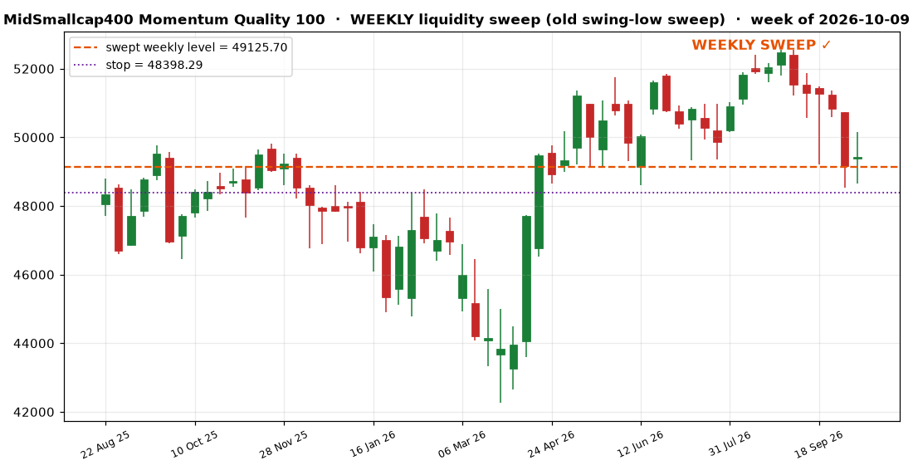

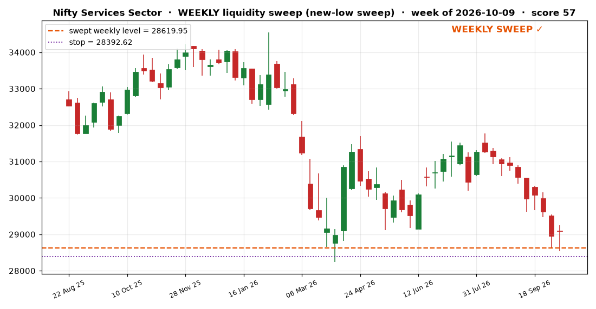

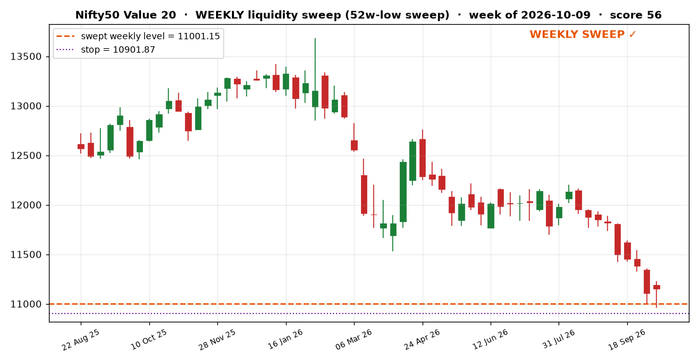

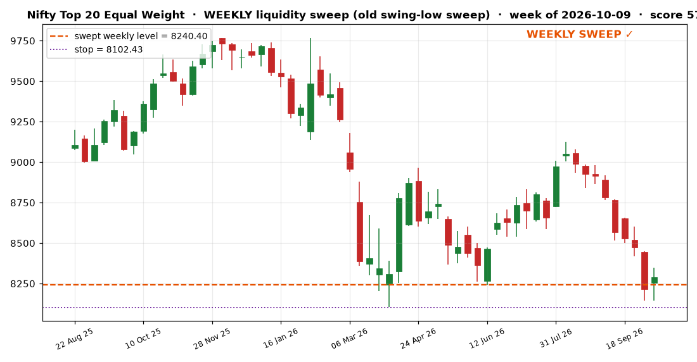

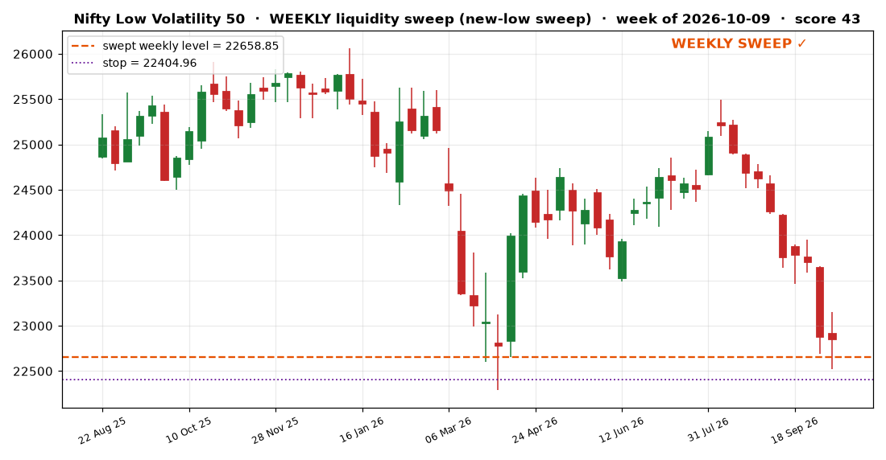

---

## 📋 SWEEP REPORT CARD — pichle setups ab KAISE chal rahe hain?

*Yahan har sweep 1-2 hafte tak dikhta rahega taaki khud dekh sako: sweep ke baad sach mein uptrend aaya ya nahi.*

### 🧲 DAILY sweeps (pichle 10 din ke 39 setups):

| Index | Sweep kab | Kitne din hue | Tab close | Ab close | Badlav | Status |
|-------|-----------|---------------|-----------|----------|--------|--------|
| **India VIX** | 2026-10-08 | 1 din | 15.28 | 14.38 | **-5.9%** | 🟡 WATCH (level ke upar tika hai) |
| **Nifty PSU Bank** | 2026-10-07 | 2 din | 8088.70 | 8126.35 | **+0.5%** | ✅ UPTREND chal raha |
| **Nifty Private Bank** | 2026-10-07 | 2 din | 27115.90 | 27222.55 | **+0.4%** | ✅ UPTREND chal raha |
| **Nifty Financial Services 25/50** | 2026-10-07 | 2 din | 26778.25 | 26822.05 | **+0.2%** | ✅ UPTREND chal raha |
| **Nifty MidSmallcap400 Momentum Quality 100** | 2026-10-07 | 2 din | 50007.80 | 49426.05 | **-1.2%** | ❌ FAIL (sweep low tod diya) |
| **Nifty Total Market Momentum Quality 50** | 2026-10-07 | 2 din | 42990.15 | 42400.70 | **-1.4%** | ❌ FAIL (sweep low tod diya) |
| **Nifty Smallcap 250** | 2026-10-07 | 2 din | 17917.75 | 17574.85 | **-1.9%** | ❌ FAIL (sweep low tod diya) |
| **Nifty Capital Markets** | 2026-10-07 | 2 din | 5288.40 | 5181.15 | **-2.0%** | ❌ FAIL (sweep low tod diya) |
| **Nifty Smallcap250 Momentum Quality 100** | 2026-10-07 | 2 din | 48413.70 | 47274.00 | **-2.4%** | ❌ FAIL (sweep low tod diya) |
| **Nifty Media** | 2026-10-06 | 3 din | 1567.70 | 1553.30 | **-0.9%** | ❌ FAIL (sweep low tod diya) |
| **Nifty500 Healthcare** | 2026-10-06 | 3 din | 21058.05 | 20679.40 | **-1.8%** | ❌ FAIL (sweep low tod diya) |
| **Nifty Auto** | 2026-10-06 | 3 din | 25541.95 | 24859.90 | **-2.7%** | ❌ FAIL (sweep low tod diya) |
| *...aur 27 setups* | | | | | | *(unme ✅ 2 / ❌ 23)* |

### 📅 WEEKLY sweeps (pichle 3 closed weeks ke 16 setups):

| Index | Sweep week | Kitne hafte hue | Pools | Tab close | Ab close | Badlav | Status |
|-------|------------|-----------------|-------|-----------|----------|--------|--------|
| **NIFTY Alpha Quality Value Low-Volatility 30** | 2026-10-09 | 0 hafte | 1 | 18675.30 | 18675.30 | **+0.0%** | 🟡 WATCH (level ke upar tika hai) |
| **NIFTY200 Quality 30** | 2026-10-09 | 0 hafte | 1 | 18863.35 | 18863.35 | **+0.0%** | 🟡 WATCH (level ke upar tika hai) |
| **Nifty Dividend Opportunities 50** | 2026-10-09 | 0 hafte | 2 ⚠️ | 5419.85 | 5419.85 | **+0.0%** | 🟡 WATCH (level ke upar tika hai) |
| **Nifty Growth Sectors 15** | 2026-10-09 | 0 hafte | 2 ⚠️ | 10422.60 | 10422.60 | **+0.0%** | 🟡 WATCH (level ke upar tika hai) |
| **Nifty IT** | 2026-10-09 | 0 hafte | 1 | 28574.90 | 28574.90 | **+0.0%** | 🟡 WATCH (level ke upar tika hai) |
| **Nifty Low Volatility 50** | 2026-10-09 | 0 hafte | 1 | 22846.90 | 22846.90 | **+0.0%** | 🟡 WATCH (level ke upar tika hai) |
| **Nifty MidSmallcap400 Momentum Quality 100** | 2026-10-09 | 0 hafte | 1 | 49426.05 | 49426.05 | **+0.0%** | 🟡 WATCH (level ke upar tika hai) |
| **Nifty Services Sector** | 2026-10-09 | 0 hafte | 1 | 29090.70 | 29090.70 | **+0.0%** | 🟡 WATCH (level ke upar tika hai) |
| **Nifty Shariah 25** | 2026-10-09 | 0 hafte | 1 | 7385.00 | 7385.00 | **+0.0%** | 🟡 WATCH (level ke upar tika hai) |
| **Nifty Top 20 Equal Weight** | 2026-10-09 | 0 hafte | 1 | 8289.60 | 8289.60 | **+0.0%** | 🟡 WATCH (level ke upar tika hai) |
| **Nifty100 Low Volatility 30** | 2026-10-09 | 0 hafte | 1 | 18625.40 | 18625.40 | **+0.0%** | 🟡 WATCH (level ke upar tika hai) |
| **Nifty50 PR 2x Leverage** | 2026-10-09 | 0 hafte | 2 ⚠️ | 10323.35 | 10323.35 | **+0.0%** | 🟡 WATCH (level ke upar tika hai) |
| *...aur 4 setups* | | | | | | | *(unme ✅ 0 / ❌ 0)* |

**Scorecard (weekly):** ✅ 0 working | ❌ 0 failed | baki watch/kamzor — market ke saath milake dekho (agar pura market gira hai to sweep-fail market ki galti hai, system ki nahi).

⚠️ = Pools≥2 (ek saath kai lows toda) — test mein ye setups KAMZOR nikle (43% beat vs 59%), inse bachke raho.

**Status samajhna:** ✅ = sweep sahi nikla, uptrend chal raha | 🟡 = level ke upar hai, thoda aur time do | 🟠 = kamzor pada | ❌ = sweep low toot gaya = setup FAIL, bhool jao

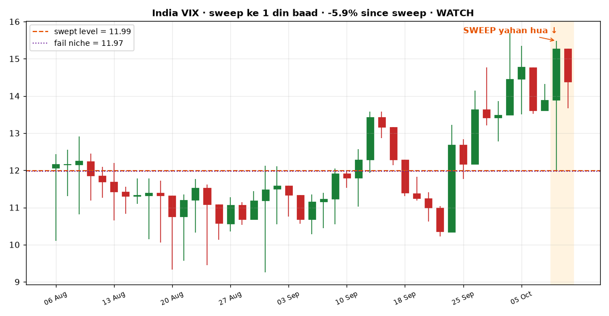

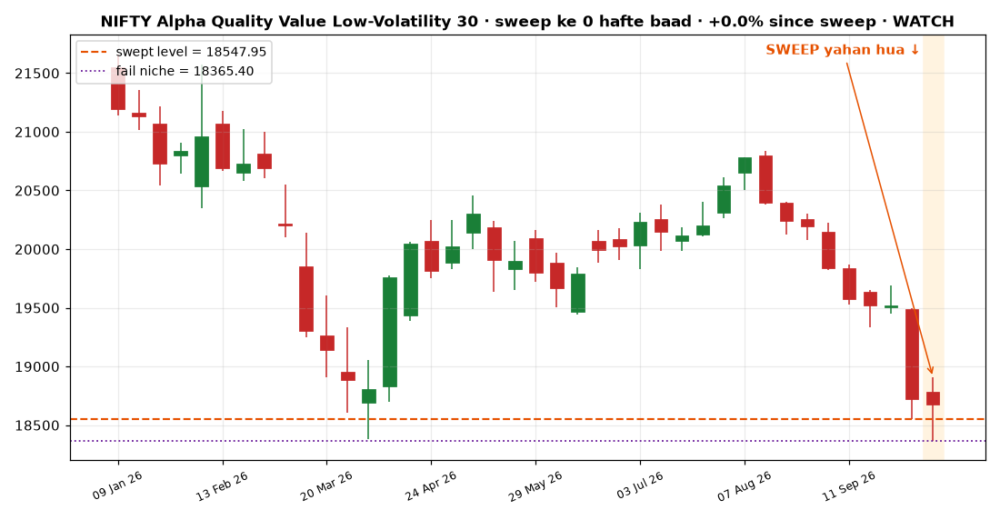

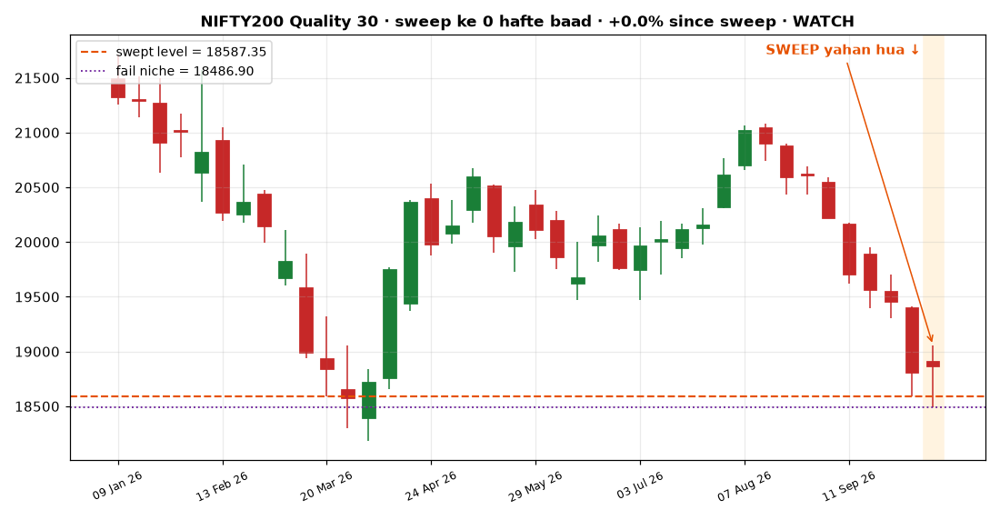

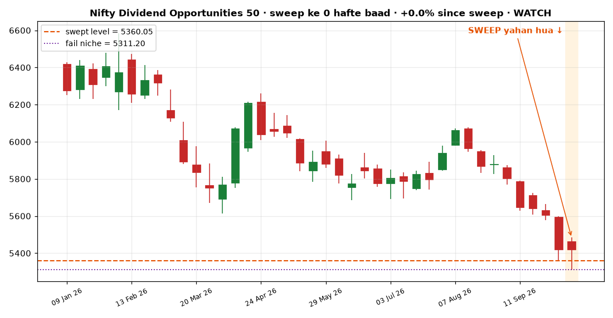

