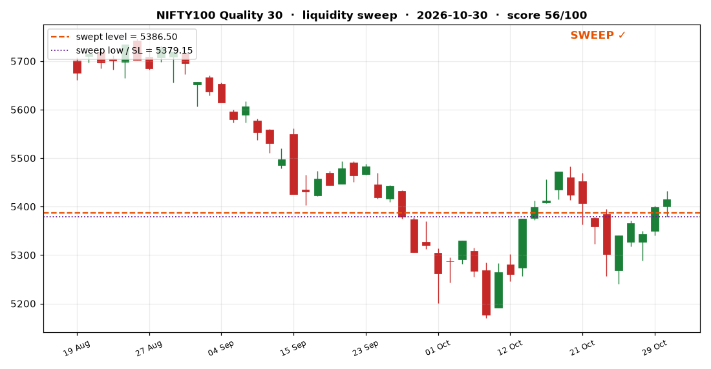
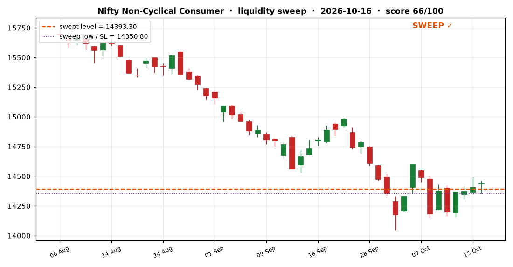
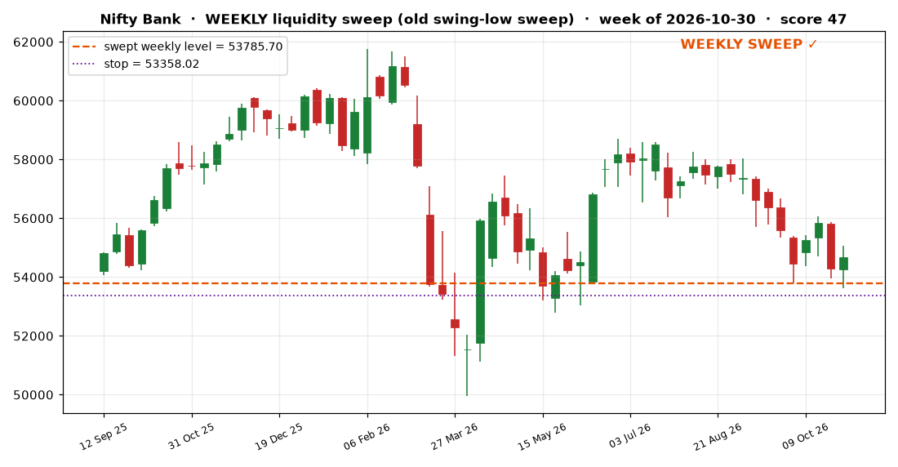
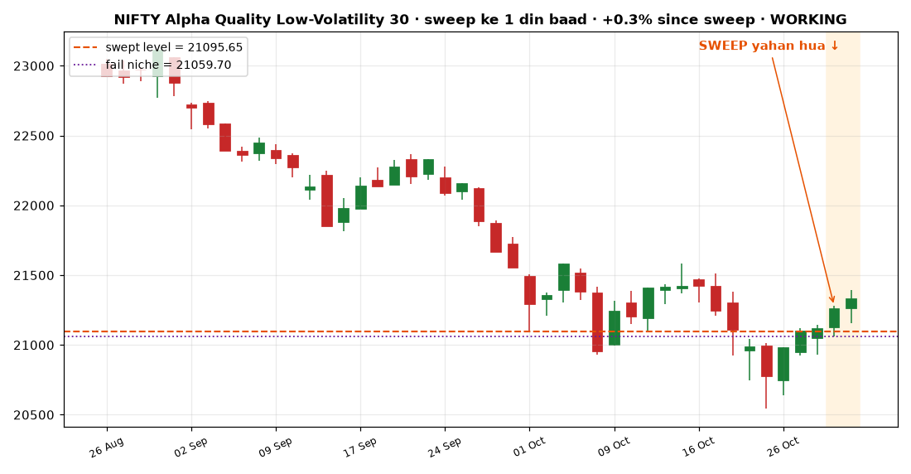
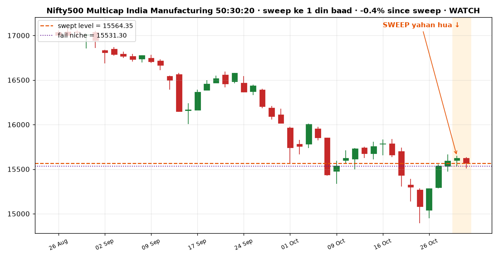
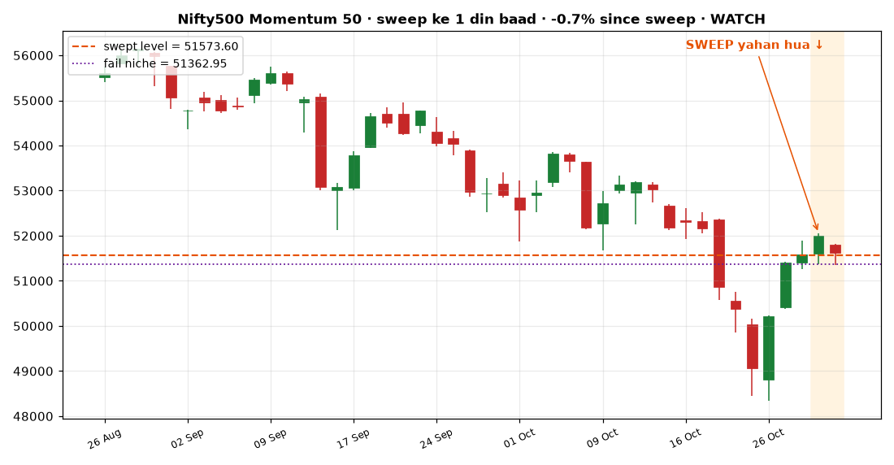
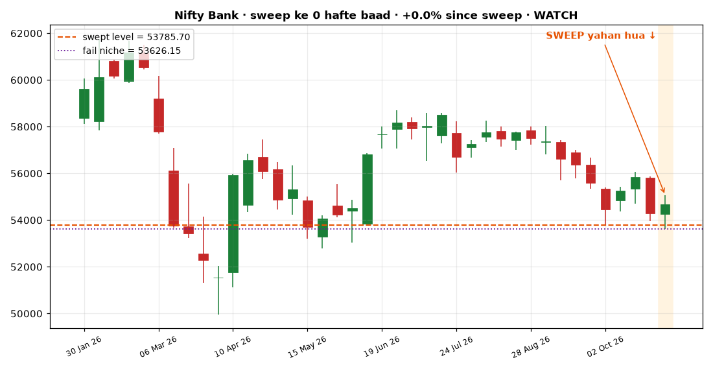

> # 🚨 SIGNAL BADLA AAJ: MILD UP -> STRONG UP | entry WEAK -> MEDIUM
# 🙋 AAJ KA SIGNAL — Simple Bhasha Mein
### Date: 2026-10-30 (shaam ke NSE data se) | Nifty: 23053.1

---

## 🟢 EK LINE MEIN:
> **Bade khiladi bullish hain (kharid rahe hain), lekin market abhi sasta nahi hua. Trade kar sakte ho, par AADHA paisa hi lagao.**

---

## ✅ STEP-BY-STEP — AAJ KARNA KYA HAI:
1. Jo amount socha tha uska sirf AADHA (50%) lagao
2. 2 kisht mein: aadha abhi, aadha agar market 2% gire
3. -10% stop-loss ka niyam yahan bhi pakka

---

## 💰 TOTAL KITNA PAISA MARKET MEIN RAKHNA HAI: **60%**
Matlab: agar tumhare paas kul **₹1,00,000** hai investing ke liye, to abhi sirf
**₹60,000** market mein ho aur **₹40,000 cash** mein.
Kyun? Market girawat mein hai LEKIN bade khiladi kharid rahe hain — dheere-dheere jama karne ka zone — isliye aadhe se thoda zyada invested raho, girawat par kharidte raho.

---

## 📖 MARKET KA HAAL (simple):
| Cheez | Status | Matlab |
|---|---|---|
| Market ka trend | **NEECHE ⬇️** | Nifty apni 200-din ki average price se niche hai = kamzor |
| Bade khiladi (FII/operators) | **STRONG UP** | score +3.09 (+2.5 se upar = zor se kharid rahe; -2.5 se niche = zor se bech rahe) |
| 🟢 Bottom signal | **off** | abhi nahi |
| 🔴 Top warning | **off** | abhi nahi |

**Is signal ki accuracy:** Aise dino ke baad 10 mein se ~7.5 baar market 2 mahine mein upar tha (avg +3.6%).

---

## 🔭 AAGE KA NAZARIYA (aaj ke OI signal ke baad kya hota aaya hai — 15 saal ka hisaab)

| Kitne time baad | Kya expect karein | Imandar sach |
|---|---|---|
| **Kal (1 din)** | 🚫 Prediction NAHI | Humne 15 saal test kiya — agle din ka koi bhi signal **coin-flip** hai (53% up, har bucket mein same). Jo bhi "kal ye hoga" bole, usse door raho. |
| **1-4 din** | +0.2% avg, 57% baar upar | Bucket se 1-4 din ka koi bharosemand edge NAHI (aaj ka bucket +0.2%/57% vs baseline +0.2%/56% — farak na ke barabar). Sirf ⚡/🌀 flags fire hone par halka jhukav banta hai. |
| **15 din (3 hafte)** | +0.8% avg, 59% baar upar | Aaj ka bucket: +0.8%/59% vs baseline +0.7%/60%. Yahan se signal jaagna shuru hota hai (curve-test: 15d par bearish edge pakki, bullish edge 20d+ se) — par asli kaam 20-60 din mein hi hota hai. |
| **1 mahina (20 din)** | +1.2% avg, **63% baar upar** | baseline jitna hi (baseline +1.0%/62%). Halka edge shuru hota hai. |
| **2 mahine (40-60 din)** | +4.2% avg, **79% baar upar** | baseline se BEHTAR (baseline +3.0%/68%). **YAHI is system ka asli edge hai** — isliye swing hold 1-2 mahine ka hai. |

> 💡 **Matlab:** aaj entry lo to result ka asli test **1-2 mahine baad** hona hai. Beech ke din-hafte ka shor ignore karo — stop-loss (-10%) ke alawa koi reaction mat do.

## 📒 SYSTEM KA APNA REPORT CARD (pichhle 12 mahine ke 207 daily signals — khud ka hisaab)

**20-din accuracy: 69%  |  40-din accuracy: 55%** (✅ = jo promise kiya wahi hua: bullish/neutral bucket → market upar; STRONG_DOWN → market baseline se kamzor)

| Bucket | Signals | 20-din sahi | 40-din sahi | Avg 20d | Avg 40d |
|---|---|---|---|---|---|
| STRONG_UP | 48 | 52% | 31% | +0.3% | -1.0% |
| MILD_UP | 32 | 72% | 38% | +1.1% | -1.6% |
| NEUTRAL | 53 | 58% | 43% | +0.0% | -1.1% |
| MILD_DOWN | 21 | 48% | 52% | -0.5% | -1.5% |
| STRONG_DOWN | 53 | 100% | 100% | -4.3% | -4.9% |

**Aakhri 6 pakke (matured) signals:**

| Signal din | Bucket | 20-din result | 40-din result |
|---|---|---|---|
| 2026-09-01 | NEUTRAL | -6.0% ❌ | -4.2% ❌ |
| 2026-08-31 | NEUTRAL | -5.7% ❌ | -4.7% ❌ |
| 2026-08-28 | MILD_DOWN | -5.8% ❌ | -6.1% ❌ |
| 2026-08-27 | MILD_DOWN | -3.9% ❌ | -5.6% ❌ |
| 2026-08-26 | MILD_DOWN | -4.7% ❌ | -6.0% ❌ |
| 2026-08-25 | NEUTRAL | -3.6% ❌ | -7.1% ❌ |

**Abhi chal rahe (open) signals:**

| Signal din | Bucket | Beete din | Ab tak |
|---|---|---|---|
| 2026-10-29 | MILD_UP | 1 din | +0.5% ⏳ |
| 2026-10-28 | NEUTRAL | 2 din | +1.6% ⏳ |
| 2026-10-27 | NEUTRAL | 3 din | +1.3% ⏳ |
| 2026-10-26 | STRONG_UP | 4 din | +1.3% ⏳ |
| 2026-10-23 | STRONG_UP | 5 din | +2.0% ⏳ |

> 🪞 **Ye section khud-ba-khud roz update hota hai — system apne purane signals se bhaag nahi sakta.** Accuracy girne lage to turant dikh jayega.

## 📋 SYSTEM KA KHULA SWING TRADE (virtual — NIFTYBEES/Nifty)

| Cheez | Status |
|---|---|
| Entry | **22,603** (2026-10-07, B3 STRONG_BUY par) |
| Abhi | **23,053** → P&L **+1.99%** 🟢 |
| Stop-loss (-10%) | **20,343** (abhi stop se +13.3% upar) |
| Exit signal | score abhi +3.1 (exit jab <= -2.5) — HOLD |
| Hold duration | 23 din (target hold: 1-2 mahine) |

> 🎯 **Matlab:** trade chaalu hai — kuch mat karo. Sirf 2 cheez par exit: (1) Nifty 20,343 ke neeche band ho, ya (2) yahan exit signal aa jaye. Beech ka shor ignore.

## 🏦 BANK NIFTY — WAHI SIGNAL, DUSRA INDEX (15-saal verified)

**Aaj:** Bank Nifty **54,687** (-0.41% din ka)

| Horizon | Aaj ke bucket (STRONG UP) ke baad BNF | Baseline |
|---|---|---|
| 15 din | +1.1% avg, 60% baar upar | +0.9% / 58% |
| 1 mahina | +1.5% avg, 62% baar upar | +1.2% / 59% |
| 2 mahine | **+3.4% avg, 75% baar upar** | +2.4% / 64% |

> 💡 Participant OI (FII/Pro) ka signal poore market ka hai — Bank Nifty par bhi 15 saal test kiya
> (correlation +0.157 @40d). STRONG_UP mein BNF ka 2-mahina record Nifty se bhi tez hai
> (out-of-sample +3.8%/79%). Trade karna ho to **BANKBEES** ETF.

## 🧭 SECTOR ROTATION — SABSE MAJBOOT SECTOR (15-saal tested)

**✅ ACTIVE** — OI signal bullish hai (score +3.1 ≥ +1.0), to sector tilt ka tested edge ABHI chalu hai.

| Rank | Sector | 6-mahina momentum |
|---|---|---|
| 1 | 🟢 **IT** | +14.8% |
| 2 | 🟢 **Telecom** | +7.2% |
| 3 | · **Pharma** | +4.0% |
| 4 | · **Realty** | +3.2% |
| 5 | · **Bank** | +2.5% |
| 6 | · **Auto** | +1.3% |
| 7 | · **CapGoods** | -4.0% |
| 8 | · **Consumer** | -4.1% |
| 9 | · **Infra** | -4.2% |
| 10 | · **Energy** | -7.3% |
| 11 | · **Cement** | -12.0% |
| 12 | · **Finance** | -13.6% |
| 13 | · **Metal** | -15.3% |
| 14 | 🔴 **FMCG** | -15.4% |
| 15 | 🔴 **Power** | -19.5% |

**Kya karna:** Agar stocks lene hain to in 2 sectors ke stocks mein lagao — **IT + Telecom**. 15-saal test: in top-2 sectors ka basket, bullish signal ke waqt, baaki market se **+0.8 se +1.0pp (40 din) / +0.8 se +1.4pp (60 din)** aage raha (out-of-sample bhi). ⚠️ Lekin: sector ke 1-2 stocks chunne ka edge test mein NAHI mila — **sector ke 3-4 bade stocks mein barabar baanto** (ya ETF jahan available: IT→ITBEES).

**Top-2 sectors ke stocks (RS order, sirf jankari ke liye):**
- **IT:** COFORGE (+68%), TECHM (+25%), PERSISTENT (+23%), MPHASIS (+19%), HCLTECH (+18%), LTTS (+13%)
- **Telecom:** IDEA (+12%), BHARTIARTL (+11%), INDUSTOWER (-1%)

> 🔴 = sabse kamzor 2 sectors — yahan naya paisa mat lagao.
> 📏 Rule yaad rakho: KAB/KITNA upar ka MASTER SIGNAL batata hai — ye section sirf **KAHAN** (kaunsa sector) batata hai. Stop-loss -10% yahan bhi.

## 💎 GEM SCANNER — aaj koi setup nahi (2026-10-30)

**Pattern (15y decoded):** 52w-high se **40%+ gira** + **EMA50 wapas reclaim** (stabilize ho gaya) + **volume 1.5x surge** (koi bada jama kar raha). Test: aise setup ka **32.4%** chance hota hai +25% move ka (normal stock ka sirf 10.7%).

Aaj koi stock teeno sharten poori nahi karta — **ye normal hai** (ye setup mahine mein ~1 baar aata hai;
isi selectivity se edge hai). **Banne ke kareeb (volume ka intezaar):** TRENT.

**📒 Pichle gems ka hisaab:** 2026-10-08 TRENT: 🔄 OPEN -1% (15d) · 2026-10-09 TRENT: 🔄 OPEN -1% (14d) · 2026-10-14 TATAELXSI: 🔄 OPEN +11% (11d)

> 🔎 *Imandari note: backtest aaj ke zinda stocks par hai (survivorship) — isliye real expectancy thodi kam maan ke chalo; position sizing (5-10% max) hi asli suraksha hai. Midcaps par ye pattern TEST KIYA aur FAIL hua (+1.2% vs +6.7-11.5%) — gems sirf LARGE-CAP mein khoje jayenge, kyunki quality ka floor wahi hota hai.*

## 🏆 STOCK SWEEP — NIFTY 50 KE SABSE STRONG STOCKS (2026-10-29)

**Rule (15-saal tested):** A+ = price EMA50 ke upar **+** RS top-10% (126-din return, 50 stocks mein).
In stocks ne equal-weight basket ko average **+1.0pp (40 din) / +1.7pp (60 din)** se beat kiya
(out-of-sample bhi positive: +0.5/+1.1pp). Edge chhota par 15 saal consistent — horizon **1-3 mahine**.

| Stock | Grade | RS rank /100 | 1-mahina return | Price |
|---|---|---|---|---|
| **DIVISLAB** | A+ ⭐ | 100 | +2.5% | 9,664 |
| **TECHM** | A+ ⭐ | 97 | +17.2% | 1,770 |
| **KOTAKBANK** | A+ ⭐ | 95 | +13.1% | 459 |
| **HCLTECH** | A+ ⭐ | 93 | +14.9% | 1,404 |
| **ICICIBANK** | A+ ⭐ | 91 | +7.3% | 1,387 |
| BHARTIARTL | B (watch) | 89 | +11.3% | 1,972 |
| DRREDDY | B (watch) | 87 | +7.4% | 1,345 |
| TCS | B (watch) | 79 | +21.9% | 2,478 |

> 💡 **Kaise use karein:** ye "kya kharidna" ka shortlist hai — lekin **kab/kitna** upar wala MASTER
> SIGNAL hi batayega. Entry signal weak ho to shortlist sirf watchlist hai. Stop-loss -10% yahan bhi pakka.

---

## 🧒 PAKKE NIYAM (har naye bande ke liye, HAMESHA):
1. **Stop-loss -10%:** jo bhi kharido, kharid-price se 10% girte hi bech do. Bina sawal. (15-saal test: -8% se -10% behtar nikla — bazaar ke chhote jhatke trade ko bekar mein nahi todte, aur bade nuksan se phir bhi bachata hai.)
2. **Kabhi ek saath pura paisa nahi** — hamesha 2-3 kisht mein.
3. **Udhaar/EMI/zaroorat ka paisa KABHI nahi** — sirf wo paisa jo 6 mahine na chahiye.
4. Ye system 10 mein se 7-8 baar sahi hai — **2-3 baar galat bhi hoga.** Isliye upar ke niyam hi tumhara asli bachav hain.
5. Kya kharidna hai confusion ho to: **NIFTYBEES** (Nifty 50 ETF) — isi index par ye pura system bana hai.

*Ye financial advice nahi hai — 15 saal ke data par bana educational system hai. | Generated: 2026-10-30T20:09:04+00:00 UTC*

---

## 🧲 INDEX SWEEP SCANNER — konsa index STRONG hai?

*Session: 2026-10-30 · scan: saare NSE indices (bond/G-sec chhodke)*

**Ye kya hai (1 line):** Jab koi index apne purane LOW ke niche wick maar ke wapas UPAR band ho (= stop-loss hunt complete), to wo index aur uske stocks aage strong rehne ke candidate hain.

### ✅ Aaj 2 index mein SWEEP COMPLETE hua:

| # | GRADE | Index | 20d RS rank | Swept Level | Depth% | Wick% | Close vs Level | RSI | Trend(>E50) | Score |
|---|-------|-------|-------------|-------------|--------|-------|----------------|-----|-------------|-------|
| 1 | 🟡 B | **NIFTY100 Quality 30** | 83/100 | 5386.50 | 0.14 | 41 | +0.54% | 52 | ❌ | 56 |
| 2 | 🟡 B | **Nifty Non-Cyclical Consumer** | 67/100 | 14292.15 | 0.17 | 65 | +0.48% | 50 | ❌ | 63 |

**GRADE ka matlab (1 saal, 131 indices, 1,486 sweeps par test kiya):**
- 🟢 **A+** = sweep + index pehle se STRONG (RS≥50) + trend upar → aage 10-20 din baaki market se behtar chalne ke best chances (+0.9% extra, 54-55% beat)
- 🟡 **B** = sweep + (strong RS *ya* uptrend, dono nahi) → theek-thaak, half conviction
- ⚪ **C** = weak index ka counter-trend sweep → KOI edge nahi mila, sirf jaankari

**Aaj ka #1: NIFTY100 Quality 30** (🟡 B) — level 5386.50 sweep karke +0.54% upar band hua.

**Kaise use karna (swing ke liye):**
- Ye WATCHLIST hai, buy-order nahi — A+ wale index (aur uske bade stocks) nazar mein rakho
- Agle din index **5386.50 ke UPAR TIKA RAHE** to setup valid
- Setup FAIL = close wapas sweep low (5379.15) ke niche → bhool jao
- Paisa lagana hamesha MASTER SIGNAL (upar wala) ke hisab se — ye scanner sirf batata hai KONSA index/sector strong hai

---

## 📅 WEEKLY SWEEP SCANNER — bada timeframe, zyada strong signal

*Last closed week ke hisab se · data till 2026-10-30 · ye signal pura hafta valid rehta hai*

**Ye kya hai (1 line):** Jo kaam daily sweep 1 din mein karta hai, wahi WEEKLY candle par ho to bade khiladi ka POORE HAFTE ka sauda dikhta hai — isliye ye signal zyada bharosemand hai (15-saal test: Nifty +8 hafte 69% win, Bank Nifty 76% win).

### ✅ Pichle closed week mein 1 index par WEEKLY SWEEP COMPLETE:

| # | GRADE | Index | Sweep type | Swept Level | Depth% | Wick% | Pools | 8w RS | Trend | Score |
|---|-------|-------|-----------|-------------|--------|-------|-------|-------|-------|-------|
| 1 | 🟢 A+ | **Nifty Bank** | old swing-low sweep | 53785.70 | 0.30 | 43 | 1 | 62/100 | ❌ | 47 |

**GRADE ka matlab (2 saal, 106 indices, 303 weekly sweeps par test):**
- 🟢 **A+** = sweep + index pehle se STRONG (8-hafte RS≥50) → agle 8 hafte market se +2.5% extra, 69% baar beat — YE wale par dhyan do
- 🟡 **B** = sweep hua par index kamzor tha → edge nahi mila, sirf jaankari

**Is hafte ka #1: Nifty Bank** — old swing-low sweep, level 53785.70 raid karke +1.68% upar band hua (1 liquidity pool ek saath saaf kiye).

**Kaise use karna (15-saal validated, swing 4-8 hafte):**
- Weekly sweep = zyada strong — ye index/sector agle 1-2 MAHINE outperform karne ka candidate
- Invalidation: weekly close wapas 53358.02 (sweep low) ke niche = setup fail
- Nifty/BankNifty par 15-saal test: sweep ke baad +8 hafte mein 69-76% baar upar, baseline se ~1-1.4% zyada
- Daily scanner (upar) = roz ka nazara; WEEKLY scanner = bada aur pakka footprint. Dono ek hi index par aayein = SABSE strong combo
- Paisa kitna lagana hai: hamesha MASTER SIGNAL ke deploy % se

---

## 📋 SWEEP REPORT CARD — pichle setups ab KAISE chal rahe hain?

*Yahan har sweep 1-2 hafte tak dikhta rahega taaki khud dekh sako: sweep ke baad sach mein uptrend aaya ya nahi.*

### 🧲 DAILY sweeps (pichle 10 din ke 65 setups):

| Index | Sweep kab | Kitne din hue | Tab close | Ab close | Badlav | Status |
|-------|-----------|---------------|-----------|----------|--------|--------|
| **Nifty Shariah 25** | 2026-10-29 | 1 din | 7625.80 | 7661.60 | **+0.5%** | ✅ UPTREND chal raha |
| **NIFTY Alpha Quality Low-Volatility 30** | 2026-10-29 | 1 din | 21263.75 | 21336.10 | **+0.3%** | ✅ UPTREND chal raha |
| **Nifty500 Multicap India Manufacturing 50:30:20** | 2026-10-29 | 1 din | 15627.00 | 15571.10 | **-0.4%** | 🟡 WATCH (level ke upar tika hai) |
| **Nifty500 Momentum 50** | 2026-10-29 | 1 din | 51999.35 | 51617.00 | **-0.7%** | 🟡 WATCH (level ke upar tika hai) |
| **Nifty Alpha 50** | 2026-10-29 | 1 din | 53204.45 | 52498.60 | **-1.3%** | 🟠 KAMZOR (level ke niche, par sweep low nahi toda) |
| **Nifty IPO** | 2026-10-29 | 1 din | 2307.30 | 2269.70 | **-1.6%** | ❌ FAIL (sweep low tod diya) |
| **NIFTY Smallcap 100** | 2026-10-29 | 1 din | 18811.35 | 18463.60 | **-1.8%** | ❌ FAIL (sweep low tod diya) |
| **Nifty IT** | 2026-10-28 | 2 din | 31553.40 | 32606.90 | **+3.3%** | ✅ UPTREND chal raha |
| **Nifty50 Shariah** | 2026-10-28 | 2 din | 4097.00 | 4194.75 | **+2.4%** | ✅ UPTREND chal raha |
| **Nifty Pharma** | 2026-10-28 | 2 din | 26541.35 | 27124.85 | **+2.2%** | ✅ UPTREND chal raha |
| **Nifty Top 20 Equal Weight** | 2026-10-28 | 2 din | 8439.15 | 8604.70 | **+2.0%** | ✅ UPTREND chal raha |
| **Nifty Non-Cyclical Consumer** | 2026-10-28 | 2 din | 14093.90 | 14361.20 | **+1.9%** | ✅ UPTREND chal raha |
| *...aur 53 setups* | | | | | | *(unme ✅ 37 / ❌ 8)* |

### 📅 WEEKLY sweeps (pichle 3 closed weeks ke 6 setups):

| Index | Sweep week | Kitne hafte hue | Pools | Tab close | Ab close | Badlav | Status |
|-------|------------|-----------------|-------|-----------|----------|--------|--------|
| **Nifty Bank** | 2026-10-30 | 0 hafte | 1 | 54686.95 | 54686.95 | **+0.0%** | 🟡 WATCH (level ke upar tika hai) |
| **Nifty PSU Bank** | 2026-10-16 | 2 hafte | 1 | 8094.95 | 8234.85 | **+1.7%** | ✅ UPTREND chal raha |
| **Nifty Infrastructure** | 2026-10-16 | 2 hafte | 1 | 8725.60 | 8799.00 | **+0.8%** | ✅ UPTREND chal raha |
| **Nifty India Tourism** | 2026-10-16 | 2 hafte | 1 | 7564.70 | 7613.45 | **+0.6%** | ✅ UPTREND chal raha |
| **Nifty India Consumption** | 2026-10-16 | 2 hafte | 1 | 11054.65 | 11090.70 | **+0.3%** | ✅ UPTREND chal raha |
| **Nifty Non-Cyclical Consumer** | 2026-10-16 | 2 hafte | 2 ⚠️ | 14438.50 | 14361.20 | **-0.5%** | 🟡 WATCH (level ke upar tika hai) |

**Scorecard (weekly):** ✅ 4 working | ❌ 0 failed | baki watch/kamzor — market ke saath milake dekho (agar pura market gira hai to sweep-fail market ki galti hai, system ki nahi).

⚠️ = Pools≥2 (ek saath kai lows toda) — test mein ye setups KAMZOR nikle (43% beat vs 59%), inse bachke raho.

**Status samajhna:** ✅ = sweep sahi nikla, uptrend chal raha | 🟡 = level ke upar hai, thoda aur time do | 🟠 = kamzor pada | ❌ = sweep low toot gaya = setup FAIL, bhool jao

