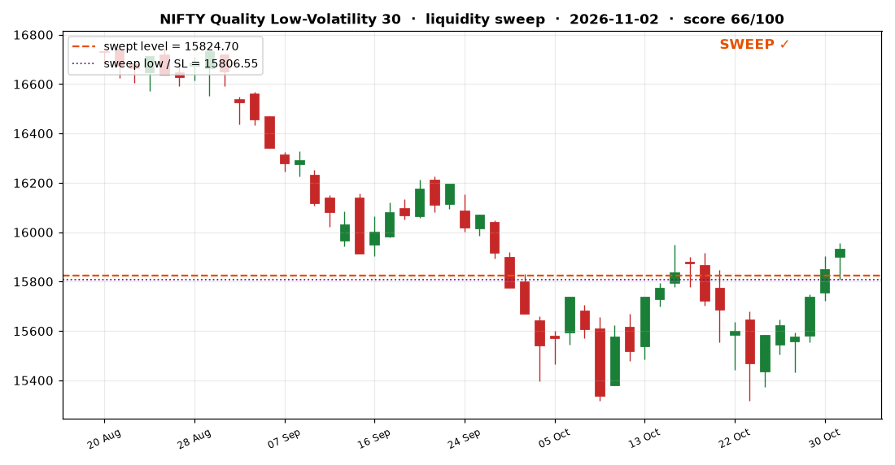
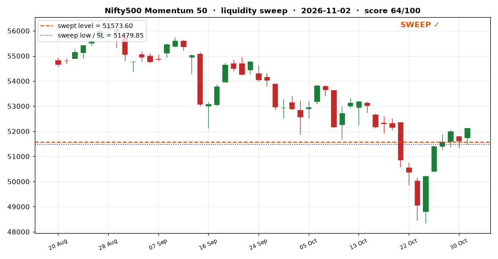
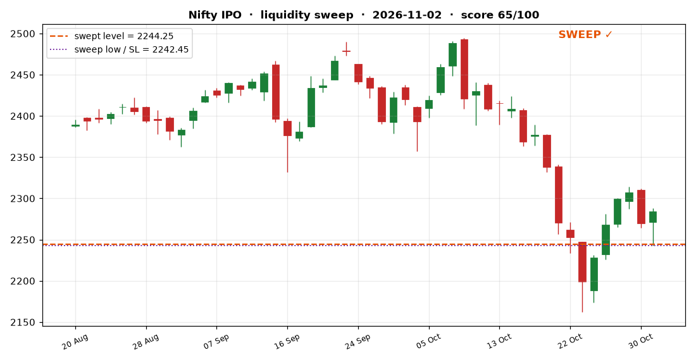
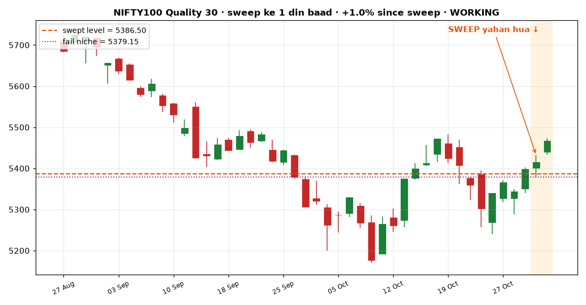
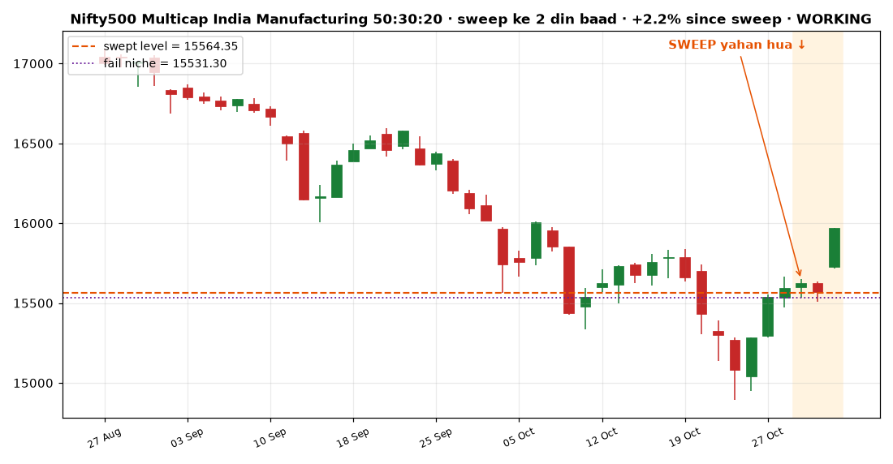
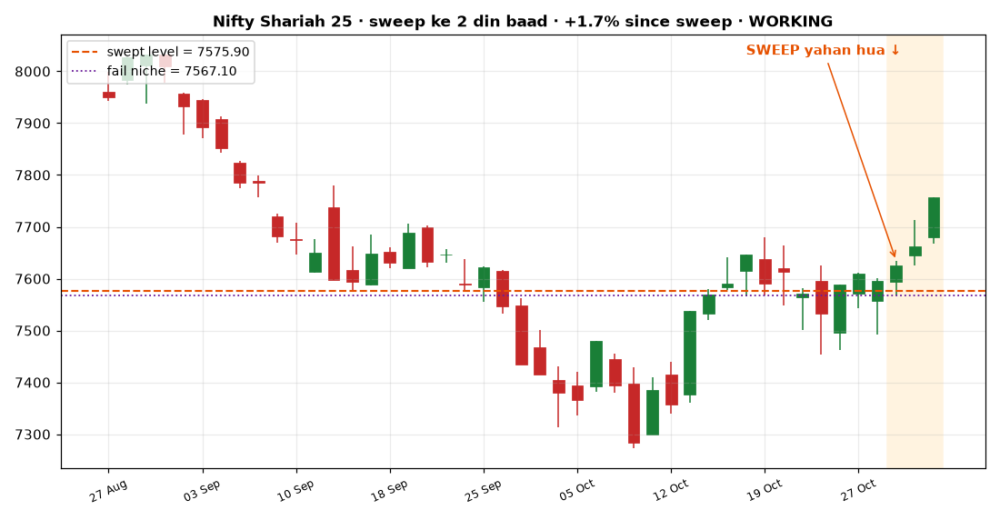
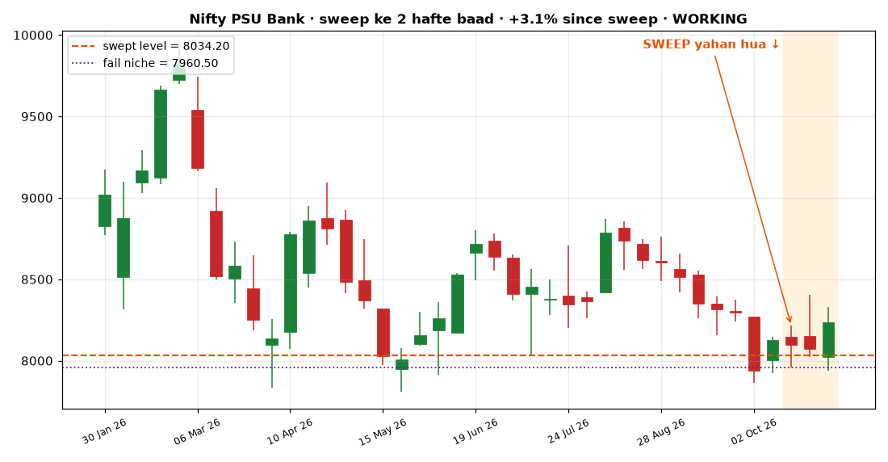

# 🙋 AAJ KA SIGNAL — Simple Bhasha Mein
### Date: 2026-11-02 (shaam ke NSE data se) | Nifty: 23440.8

---

## 🟢 EK LINE MEIN:
> **Bade khiladi bullish hain (kharid rahe hain), lekin market abhi sasta nahi hua. Trade kar sakte ho, par AADHA paisa hi lagao.**

---

## ✅ STEP-BY-STEP — AAJ KARNA KYA HAI:
1. Jo amount socha tha uska sirf AADHA (50%) lagao
2. 2 kisht mein: aadha abhi, aadha agar market 2% gire
3. -10% stop-loss ka niyam yahan bhi pakka

---

## 💰 TOTAL KITNA PAISA MARKET MEIN RAKHNA HAI: **60%**
Matlab: agar tumhare paas kul **₹1,00,000** hai investing ke liye, to abhi sirf
**₹60,000** market mein ho aur **₹40,000 cash** mein.
Kyun? Market girawat mein hai LEKIN bade khiladi kharid rahe hain — dheere-dheere jama karne ka zone — isliye aadhe se thoda zyada invested raho, girawat par kharidte raho.

---

## 📖 MARKET KA HAAL (simple):
| Cheez | Status | Matlab |
|---|---|---|
| Market ka trend | **NEECHE ⬇️** | Nifty apni 200-din ki average price se niche hai = kamzor |
| Bade khiladi (FII/operators) | **STRONG UP** | score +3.60 (+2.5 se upar = zor se kharid rahe; -2.5 se niche = zor se bech rahe) |
| 🟢 Bottom signal | **off** | abhi nahi |
| 🔴 Top warning | **off** | abhi nahi |

**Is signal ki accuracy:** Aise dino ke baad 10 mein se ~7.5 baar market 2 mahine mein upar tha (avg +3.6%).

---

## 🔭 AAGE KA NAZARIYA (aaj ke OI signal ke baad kya hota aaya hai — 15 saal ka hisaab)

| Kitne time baad | Kya expect karein | Imandar sach |
|---|---|---|
| **Kal (1 din)** | 🚫 Prediction NAHI | Humne 15 saal test kiya — agle din ka koi bhi signal **coin-flip** hai (53% up, har bucket mein same). Jo bhi "kal ye hoga" bole, usse door raho. |
| **1-4 din** | +0.2% avg, 57% baar upar | Bucket se 1-4 din ka koi bharosemand edge NAHI (aaj ka bucket +0.2%/57% vs baseline +0.2%/56% — farak na ke barabar). Sirf ⚡/🌀 flags fire hone par halka jhukav banta hai. |
| **15 din (3 hafte)** | +0.8% avg, 59% baar upar | Aaj ka bucket: +0.8%/59% vs baseline +0.7%/60%. Yahan se signal jaagna shuru hota hai (curve-test: 15d par bearish edge pakki, bullish edge 20d+ se) — par asli kaam 20-60 din mein hi hota hai. |
| **1 mahina (20 din)** | +1.2% avg, **63% baar upar** | baseline jitna hi (baseline +1.0%/62%). Halka edge shuru hota hai. |
| **2 mahine (40-60 din)** | +4.2% avg, **79% baar upar** | baseline se BEHTAR (baseline +3.0%/68%). **YAHI is system ka asli edge hai** — isliye swing hold 1-2 mahine ka hai. |

> 💡 **Matlab:** aaj entry lo to result ka asli test **1-2 mahine baad** hona hai. Beech ke din-hafte ka shor ignore karo — stop-loss (-10%) ke alawa koi reaction mat do.

## 📒 SYSTEM KA APNA REPORT CARD (pichhle 12 mahine ke 206 daily signals — khud ka hisaab)

**20-din accuracy: 68%  |  40-din accuracy: 54%** (✅ = jo promise kiya wahi hua: bullish/neutral bucket → market upar; STRONG_DOWN → market baseline se kamzor)

| Bucket | Signals | 20-din sahi | 40-din sahi | Avg 20d | Avg 40d |
|---|---|---|---|---|---|
| STRONG_UP | 48 | 52% | 31% | +0.3% | -1.0% |
| MILD_UP | 31 | 71% | 35% | +1.1% | -1.7% |
| NEUTRAL | 53 | 57% | 42% | -0.1% | -1.2% |
| MILD_DOWN | 21 | 48% | 52% | -0.5% | -1.5% |
| STRONG_DOWN | 53 | 100% | 100% | -4.3% | -4.9% |

**Aakhri 6 pakke (matured) signals:**

| Signal din | Bucket | 20-din result | 40-din result |
|---|---|---|---|
| 2026-09-02 | NEUTRAL | -6.2% ❌ | -2.0% ❌ |
| 2026-09-01 | NEUTRAL | -6.0% ❌ | -4.2% ❌ |
| 2026-08-31 | NEUTRAL | -5.7% ❌ | -4.7% ❌ |
| 2026-08-28 | MILD_DOWN | -5.8% ❌ | -6.1% ❌ |
| 2026-08-27 | MILD_DOWN | -3.9% ❌ | -5.6% ❌ |
| 2026-08-26 | MILD_DOWN | -4.7% ❌ | -6.0% ❌ |

**Abhi chal rahe (open) signals:**

| Signal din | Bucket | Beete din | Ab tak |
|---|---|---|---|
| 2026-10-30 | STRONG_UP | 1 din | +1.7% ⏳ |
| 2026-10-29 | MILD_UP | 2 din | +2.2% ⏳ |
| 2026-10-28 | NEUTRAL | 3 din | +3.3% ⏳ |
| 2026-10-27 | NEUTRAL | 4 din | +3.0% ⏳ |
| 2026-10-26 | STRONG_UP | 5 din | +3.0% ⏳ |

> 🪞 **Ye section khud-ba-khud roz update hota hai — system apne purane signals se bhaag nahi sakta.** Accuracy girne lage to turant dikh jayega.

## 📋 SYSTEM KA KHULA SWING TRADE (virtual — NIFTYBEES/Nifty)

| Cheez | Status |
|---|---|
| Entry | **22,603** (2026-10-07, B3 STRONG_BUY par) |
| Abhi | **23,441** → P&L **+3.71%** 🟢 |
| Stop-loss (-10%) | **20,343** (abhi stop se +15.2% upar) |
| Exit signal | score abhi +3.6 (exit jab <= -2.5) — HOLD |
| Hold duration | 26 din (target hold: 1-2 mahine) |

> 🎯 **Matlab:** trade chaalu hai — kuch mat karo. Sirf 2 cheez par exit: (1) Nifty 20,343 ke neeche band ho, ya (2) yahan exit signal aa jaye. Beech ka shor ignore.

## 🏦 BANK NIFTY — WAHI SIGNAL, DUSRA INDEX (15-saal verified)

**Aaj:** Bank Nifty **55,002** (+0.58% din ka)

| Horizon | Aaj ke bucket (STRONG UP) ke baad BNF | Baseline |
|---|---|---|
| 15 din | +1.1% avg, 60% baar upar | +0.9% / 58% |
| 1 mahina | +1.5% avg, 62% baar upar | +1.2% / 59% |
| 2 mahine | **+3.4% avg, 75% baar upar** | +2.4% / 64% |

> 💡 Participant OI (FII/Pro) ka signal poore market ka hai — Bank Nifty par bhi 15 saal test kiya
> (correlation +0.157 @40d). STRONG_UP mein BNF ka 2-mahina record Nifty se bhi tez hai
> (out-of-sample +3.8%/79%). Trade karna ho to **BANKBEES** ETF.

## 🧭 SECTOR ROTATION — SABSE MAJBOOT SECTOR (15-saal tested)

**✅ ACTIVE** — OI signal bullish hai (score +3.6 ≥ +1.0), to sector tilt ka tested edge ABHI chalu hai.

| Rank | Sector | 6-mahina momentum |
|---|---|---|
| 1 | 🟢 **IT** | +14.9% |
| 2 | 🟢 **Pharma** | +3.3% |
| 3 | · **Telecom** | +3.3% |
| 4 | · **Realty** | +0.9% |
| 5 | · **Bank** | -0.7% |
| 6 | · **Auto** | -2.2% |
| 7 | · **Consumer** | -4.7% |
| 8 | · **CapGoods** | -5.1% |
| 9 | · **Infra** | -6.8% |
| 10 | · **Energy** | -9.1% |
| 11 | · **Cement** | -14.3% |
| 12 | · **FMCG** | -15.7% |
| 13 | · **Finance** | -16.4% |
| 14 | 🔴 **Metal** | -16.6% |
| 15 | 🔴 **Power** | -18.8% |

**Kya karna:** Agar stocks lene hain to in 2 sectors ke stocks mein lagao — **IT + Pharma**. 15-saal test: in top-2 sectors ka basket, bullish signal ke waqt, baaki market se **+0.8 se +1.0pp (40 din) / +0.8 se +1.4pp (60 din)** aage raha (out-of-sample bhi). ⚠️ Lekin: sector ke 1-2 stocks chunne ka edge test mein NAHI mila — **sector ke 3-4 bade stocks mein barabar baanto** (ya ETF jahan available: IT→ITBEES, Pharma→PHARMABEES).

**Top-2 sectors ke stocks (RS order, sirf jankari ke liye):**
- **IT:** COFORGE (+60%), TECHM (+25%), HCLTECH (+21%), PERSISTENT (+21%), MPHASIS (+17%), LTTS (+14%)
- **Pharma:** DIVISLAB (+47%), ZYDUSLIFE (+33%), AUROPHARMA (+13%), APOLLOHOSP (+9%), TORNTPHARM (+6%), DRREDDY (+4%)

> 🔴 = sabse kamzor 2 sectors — yahan naya paisa mat lagao.
> 📏 Rule yaad rakho: KAB/KITNA upar ka MASTER SIGNAL batata hai — ye section sirf **KAHAN** (kaunsa sector) batata hai. Stop-loss -10% yahan bhi.

## 💎 GEM SCANNER — aaj koi setup nahi (2026-11-02)

**Pattern (15y decoded):** 52w-high se **40%+ gira** + **EMA50 wapas reclaim** (stabilize ho gaya) + **volume 1.5x surge** (koi bada jama kar raha). Test: aise setup ka **32.4%** chance hota hai +25% move ka (normal stock ka sirf 10.7%).

Aaj koi stock teeno sharten poori nahi karta — **ye normal hai** (ye setup mahine mein ~1 baar aata hai;
isi selectivity se edge hai).

**📒 Pichle gems ka hisaab:** 2026-10-08 TRENT: 🔄 OPEN +5% (16d) · 2026-10-09 TRENT: 🔄 OPEN +5% (15d) · 2026-10-14 TATAELXSI: 🔄 OPEN +11% (12d)

> 🔎 *Imandari note: backtest aaj ke zinda stocks par hai (survivorship) — isliye real expectancy thodi kam maan ke chalo; position sizing (5-10% max) hi asli suraksha hai. Midcaps par ye pattern TEST KIYA aur FAIL hua (+1.2% vs +6.7-11.5%) — gems sirf LARGE-CAP mein khoje jayenge, kyunki quality ka floor wahi hota hai.*

## 🏆 STOCK SWEEP — NIFTY 50 KE SABSE STRONG STOCKS (2026-10-30)

**Rule (15-saal tested):** A+ = price EMA50 ke upar **+** RS top-10% (126-din return, 50 stocks mein).
In stocks ne equal-weight basket ko average **+1.0pp (40 din) / +1.7pp (60 din)** se beat kiya
(out-of-sample bhi positive: +0.5/+1.1pp). Edge chhota par 15 saal consistent — horizon **1-3 mahine**.

| Stock | Grade | RS rank /100 | 1-mahina return | Price |
|---|---|---|---|---|
| **DIVISLAB** | A+ ⭐ | 100 | +5.3% | 9,780 |
| **TECHM** | A+ ⭐ | 97 | +17.5% | 1,791 |
| **KOTAKBANK** | A+ ⭐ | 95 | +10.7% | 462 |
| **HCLTECH** | A+ ⭐ | 93 | +16.1% | 1,428 |
| **ICICIBANK** | A+ ⭐ | 91 | +5.8% | 1,398 |
| BHARTIARTL | B (watch) | 89 | +12.3% | 1,974 |
| APOLLOHOSP | B (watch) | 87 | +3.5% | 8,448 |
| TRENT | B (watch) | 85 | +15.1% | 3,017 |

> 💡 **Kaise use karein:** ye "kya kharidna" ka shortlist hai — lekin **kab/kitna** upar wala MASTER
> SIGNAL hi batayega. Entry signal weak ho to shortlist sirf watchlist hai. Stop-loss -10% yahan bhi pakka.

---

## 🧒 PAKKE NIYAM (har naye bande ke liye, HAMESHA):
1. **Stop-loss -10%:** jo bhi kharido, kharid-price se 10% girte hi bech do. Bina sawal. (15-saal test: -8% se -10% behtar nikla — bazaar ke chhote jhatke trade ko bekar mein nahi todte, aur bade nuksan se phir bhi bachata hai.)
2. **Kabhi ek saath pura paisa nahi** — hamesha 2-3 kisht mein.
3. **Udhaar/EMI/zaroorat ka paisa KABHI nahi** — sirf wo paisa jo 6 mahine na chahiye.
4. Ye system 10 mein se 7-8 baar sahi hai — **2-3 baar galat bhi hoga.** Isliye upar ke niyam hi tumhara asli bachav hain.
5. Kya kharidna hai confusion ho to: **NIFTYBEES** (Nifty 50 ETF) — isi index par ye pura system bana hai.

*Ye financial advice nahi hai — 15 saal ke data par bana educational system hai. | Generated: 2026-11-02T23:14:28+00:00 UTC*

---

## 🧲 INDEX SWEEP SCANNER — konsa index STRONG hai?

*Session: 2026-11-02 · scan: saare NSE indices (bond/G-sec chhodke)*

**Ye kya hai (1 line):** Jab koi index apne purane LOW ke niche wick maar ke wapas UPAR band ho (= stop-loss hunt complete), to wo index aur uske stocks aage strong rehne ke candidate hain.

### ✅ Aaj 3 index mein SWEEP COMPLETE hua:

| # | GRADE | Index | 20d RS rank | Swept Level | Depth% | Wick% | Close vs Level | RSI | Trend(>E50) | Score |
|---|-------|-------|-------------|-------------|--------|-------|----------------|-----|-------------|-------|
| 1 | 🟡 B | **NIFTY Quality Low-Volatility 30** | 70/100 | 15824.70 | 0.11 | 63 | +0.68% | 55 | ❌ | 66 |
| 2 | ⚪ C | **Nifty500 Momentum 50** | 24/100 | 51573.60 | 0.18 | 39 | +1.06% | 49 | ❌ | 64 |
| 3 | ⚪ C | **Nifty IPO** | 2/100 | 2244.25 | 0.08 | 63 | +1.79% | 42 | ❌ | 65 |

**GRADE ka matlab (1 saal, 131 indices, 1,486 sweeps par test kiya):**
- 🟢 **A+** = sweep + index pehle se STRONG (RS≥50) + trend upar → aage 10-20 din baaki market se behtar chalne ke best chances (+0.9% extra, 54-55% beat)
- 🟡 **B** = sweep + (strong RS *ya* uptrend, dono nahi) → theek-thaak, half conviction
- ⚪ **C** = weak index ka counter-trend sweep → KOI edge nahi mila, sirf jaankari

**Aaj ka #1: NIFTY Quality Low-Volatility 30** (🟡 B) — level 15824.70 sweep karke +0.68% upar band hua.

**Kaise use karna (swing ke liye):**
- Ye WATCHLIST hai, buy-order nahi — A+ wale index (aur uske bade stocks) nazar mein rakho
- Agle din index **15824.70 ke UPAR TIKA RAHE** to setup valid
- Setup FAIL = close wapas sweep low (15806.55) ke niche → bhool jao
- Paisa lagana hamesha MASTER SIGNAL (upar wala) ke hisab se — ye scanner sirf batata hai KONSA index/sector strong hai

---

## 📅 WEEKLY SWEEP SCANNER — bada timeframe, zyada strong signal

*Last closed week ke hisab se · data till 2026-11-02 · ye signal pura hafta valid rehta hai*

**Ye kya hai (1 line):** Jo kaam daily sweep 1 din mein karta hai, wahi WEEKLY candle par ho to bade khiladi ka POORE HAFTE ka sauda dikhta hai — isliye ye signal zyada bharosemand hai (15-saal test: Nifty +8 hafte 69% win, Bank Nifty 76% win).

### ✅ Pichle closed week mein 1 index par WEEKLY SWEEP COMPLETE:

| # | GRADE | Index | Sweep type | Swept Level | Depth% | Wick% | Pools | 8w RS | Trend | Score |
|---|-------|-------|-----------|-------------|--------|-------|-------|-------|-------|-------|
| 1 | 🟢 A+ | **Nifty Bank** | old swing-low sweep | 53785.70 | 0.30 | 43 | 1 | 51/100 | ❌ | 47 |

**GRADE ka matlab (2 saal, 106 indices, 303 weekly sweeps par test):**
- 🟢 **A+** = sweep + index pehle se STRONG (8-hafte RS≥50) → agle 8 hafte market se +2.5% extra, 69% baar beat — YE wale par dhyan do
- 🟡 **B** = sweep hua par index kamzor tha → edge nahi mila, sirf jaankari

**Is hafte ka #1: Nifty Bank** — old swing-low sweep, level 53785.70 raid karke +1.68% upar band hua (1 liquidity pool ek saath saaf kiye).

**Kaise use karna (15-saal validated, swing 4-8 hafte):**
- Weekly sweep = zyada strong — ye index/sector agle 1-2 MAHINE outperform karne ka candidate
- Invalidation: weekly close wapas 53358.02 (sweep low) ke niche = setup fail
- Nifty/BankNifty par 15-saal test: sweep ke baad +8 hafte mein 69-76% baar upar, baseline se ~1-1.4% zyada
- Daily scanner (upar) = roz ka nazara; WEEKLY scanner = bada aur pakka footprint. Dono ek hi index par aayein = SABSE strong combo
- Paisa kitna lagana hai: hamesha MASTER SIGNAL ke deploy % se

### ⏳ IS HAFTE BAN RAHE HAIN (abhi confirm NAHI — Friday close ka wait karo):

| Index | Sweep type | Level | 8w RS | Score (abhi tak) |
|-------|-----------|-------|-------|------------------|
| India VIX | old swing-low sweep | 15.17 | 100/100 | 68 |
| Nifty Top 10 Equal Weight | old swing-low sweep | 8510.60 | 96/100 | 62 |

⚠️ Hafta khatam hone se pehle ye badal/gayab ho sakte hain — sirf nazar rakho, act Friday ke baad.

---

## 📋 SWEEP REPORT CARD — pichle setups ab KAISE chal rahe hain?

*Yahan har sweep 1-2 hafte tak dikhta rahega taaki khud dekh sako: sweep ke baad sach mein uptrend aaya ya nahi.*

### 🧲 DAILY sweeps (pichle 10 din ke 63 setups):

| Index | Sweep kab | Kitne din hue | Tab close | Ab close | Badlav | Status |
|-------|-----------|---------------|-----------|----------|--------|--------|
| **Nifty Non-Cyclical Consumer** | 2026-10-30 | 1 din | 14361.20 | 14520.85 | **+1.1%** | ✅ UPTREND chal raha |
| **NIFTY100 Quality 30** | 2026-10-30 | 1 din | 5415.40 | 5467.35 | **+1.0%** | ✅ UPTREND chal raha |
| **Nifty500 Multicap India Manufacturing 50:30:20** | 2026-10-29 | 2 din | 15627.00 | 15969.75 | **+2.2%** | ✅ UPTREND chal raha |
| **Nifty Shariah 25** | 2026-10-29 | 2 din | 7625.80 | 7757.05 | **+1.7%** | ✅ UPTREND chal raha |
| **NIFTY Alpha Quality Low-Volatility 30** | 2026-10-29 | 2 din | 21263.75 | 21507.60 | **+1.1%** | ✅ UPTREND chal raha |
| **Nifty500 Momentum 50** | 2026-10-29 | 2 din | 51999.35 | 52122.60 | **+0.2%** | ✅ UPTREND chal raha |
| **Nifty Alpha 50** | 2026-10-29 | 2 din | 53204.45 | 52725.40 | **-0.9%** | 🟡 WATCH (level ke upar tika hai) |
| **Nifty IPO** | 2026-10-29 | 2 din | 2307.30 | 2284.40 | **-1.0%** | ❌ FAIL (sweep low tod diya) |
| **NIFTY Smallcap 100** | 2026-10-29 | 2 din | 18811.35 | 18595.30 | **-1.1%** | 🟠 KAMZOR (level ke niche, par sweep low nahi toda) |
| **Nifty Top 20 Equal Weight** | 2026-10-28 | 3 din | 8439.15 | 8701.50 | **+3.1%** | ✅ UPTREND chal raha |
| **Nifty India Corporate Group Index - Tata Group 25% Cap** | 2026-10-28 | 3 din | 13683.35 | 14095.45 | **+3.0%** | ✅ UPTREND chal raha |
| **Nifty200 Value 30** | 2026-10-28 | 3 din | 13678.15 | 14086.55 | **+3.0%** | ✅ UPTREND chal raha |
| *...aur 51 setups* | | | | | | *(unme ✅ 45 / ❌ 4)* |

### 📅 WEEKLY sweeps (pichle 3 closed weeks ke 6 setups):

| Index | Sweep week | Kitne hafte hue | Pools | Tab close | Ab close | Badlav | Status |
|-------|------------|-----------------|-------|-----------|----------|--------|--------|
| **Nifty Bank** | 2026-10-30 | 0 hafte | 1 | 54686.95 | 55002.20 | **+0.6%** | ✅ UPTREND chal raha |
| **Nifty Infrastructure** | 2026-10-16 | 2 hafte | 1 | 8725.60 | 9124.95 | **+4.6%** | ✅ UPTREND chal raha |
| **Nifty PSU Bank** | 2026-10-16 | 2 hafte | 1 | 8094.95 | 8346.95 | **+3.1%** | ✅ UPTREND chal raha |
| **Nifty India Tourism** | 2026-10-16 | 2 hafte | 1 | 7564.70 | 7733.75 | **+2.2%** | ✅ UPTREND chal raha |
| **Nifty India Consumption** | 2026-10-16 | 2 hafte | 1 | 11054.65 | 11202.65 | **+1.3%** | ✅ UPTREND chal raha |
| **Nifty Non-Cyclical Consumer** | 2026-10-16 | 2 hafte | 2 ⚠️ | 14438.50 | 14520.85 | **+0.6%** | ✅ UPTREND chal raha |

**Scorecard (weekly):** ✅ 6 working | ❌ 0 failed | baki watch/kamzor — market ke saath milake dekho (agar pura market gira hai to sweep-fail market ki galti hai, system ki nahi).

⚠️ = Pools≥2 (ek saath kai lows toda) — test mein ye setups KAMZOR nikle (43% beat vs 59%), inse bachke raho.

**Status samajhna:** ✅ = sweep sahi nikla, uptrend chal raha | 🟡 = level ke upar hai, thoda aur time do | 🟠 = kamzor pada | ❌ = sweep low toot gaya = setup FAIL, bhool jao

